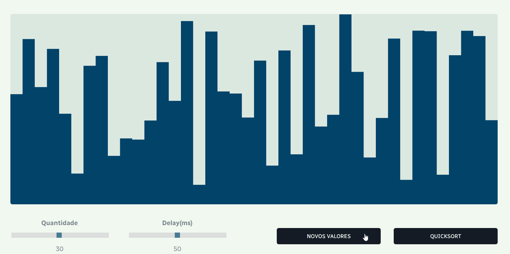

# Algoritmo Quicksort

Acesse o link do projeto: <a target="_blank">https://henriquesoriano.github.io/Algoritmo-Quicksort</a>

### Projeto desenvolvido em JavaScript para execução e viualização do algoritmo Quicksort


### Sobre o Quicksort

O Quicksort é um algoritmo de ordenação por divisão e conquista. Seu funcionamento é baseado em uma função fundamental, chamada `partition`, que é executada em diferentes partes do _Array_ simultâneamente. Essa função organiza todos valores de um _Array_ em relação a um valor específico, chamado pivô. A fim da função, todos valores maiores que o pivô estarão posicionados a sua direita, e todos valores menores a sua esquerda.

## As funções que compoem o algoritmo Quicksort são:

### Função Partition

```
async function partition(arr, comeco, fim) {

    let pivoIndice = comeco;
    let pivoValor = arr[fim];

    for (let i = comeco; i < fim; i++) {
        if (arr[i] < pivoValor) {
            await trocar(arr, i, pivoIndice);
            pivoIndice++;
        }
    }
    
    await trocar(arr, pivoIndice, fim);
    for (let i = comeco; i < fim; i++) {
        if (i != pivoIndice) {
        }
    }
    return pivoIndice;
}

```
#### A função Partition possui os seguintes parâmetros: 
+ **_arr_**: recebe o _Array_ em que a função executará.
+ **_comeco_**: recebe o prmeiro item do _Array_.
+ **_fim_**: rcebe o último item do _Array_.

#### Funcionamento da função Partition:
+ Primeiramente, as variáveis `pivoIndice` e `pivoValor` são declaradas em relação aos parâmetros `comeco` e `fim`.
+ Em um laço _for_, é verificado se cada item possui valor menor que o último item do _Array_ em questão, sendo esse último item o pivô.
+ Caso o item comparado não seja de valor menor que o pivô, a função continua, passando a comparar o próximo item.
+ Caso algum item possua valor menor que o pivô, é feita a troca do valor desse item com o valor do item do `pivoIndice`, posicionando esse valor menor a esquerda do _Array_. Após a troca, o valor de `pivoIndice` é encrementado, passando a ser o próximo item do _Array_.
+ Após todas comprações, é feita a troca de valores do pivô com o indice. Assim, temos um _Array_ organizado em relação ao pivô.
+ Por fim, é retornado o valor da posição do `pivoIndice` para ser usado na função `Quicksort`.

<br><p align="center"></p>

### Função Quicksort

```
async function quickSort(arr, comeco, fim) {

    if (comeco >= fim) {
        return;
    }

    let indice = await partition(arr, comeco, fim);
    
    await Promise.all([
        quickSort(arr, comeco, indice - 1),
        quickSort(arr, indice + 1, fim)
    ]);
}
```
> A função `Quicksort` define os parâmetros para a execução da função Partition. Logo, elas possuem os mesmos parâmetros.

#### Funcionamento da função Quicksort:
+ A condição `comeco >= fim` verifica se o _Array_ possui tamanho suficiente para que ocorra troca de valores. Caso não possua, a função é encerrada com a declaração `return`.
+ A variável indice recebe o valor retornado da função `Partition`, que é executada e determina o pivô.
+ Após organizar o _Array_ em duas partes(maior e menor) em relação ao pivô, a própria função `Quicksort` é executada em ambas partes.
#### Conceitos utilizados:
+ **Ordenação por Divisão e Conquista:** Consiste em dividir um problema maior em partes menores, para solucioná-las de maneira recursiva.
+ **Recursividade:** Uma função recursiva é uma função que chama a si mesma até que seja interrompida.

### Função Trocar

```
async function trocar(arr, a, b) {

    await delay(velocicade);

    let varTemporaria = arr[a];
    arr[a] = arr[b];
    arr[b] = varTemporaria;
}
```
> A função `Delay` determina a velocidade das trocas em milissegundos. Quanto menor o delay, mais rápida a troca.

A função `Trocar` é responsável por efetuar a troca entre os valores comparados pela função `Partition`. Essa função utiliza uma variável temporária para armazenar um valor enquanto faz a troca.

<br><p align="center"></p><br>

### Função Delay

```
function delay(ms) {
    return new Promise(resolve => setTimeout(resolve, ms));
}
```
Para que as trocas e comparações sejam visíveis, a função `Delay` é executada em cada troca. Sendo `Trocar`, uma função assíncrona(_async_), ela espera a execução da função `Delay`(_await_) para que sejam feitas as trocas.
> O parâmetro para determinar os milissegundos recebe como _default_, o valor 50. Porém, esse valor pode ser alterado pelo usuário através do _slider_ **Delay(ms)**.

<br><br>

### Função callQuicksort

```
async function callQuicksort(arr, comeco, fim) {

    if (count == 1) {
        return;
    } else if (count == 0) {
        await checarOrdem(arr);
        
        if (ordem == true) {
            return; 
        } else if (ordem == false) {
            count = 1;
            await quickSort(arr, comeco, fim);
            count = 0;
        }  
    }
}
```
### Funcionamento da função:
+ Essa função basicamente condiciona a execução da função `Quicksort`, impedindo ela de acontecer em algumas situações indesejáveis.
+ A variável `count` recebe valor igual a 1 enquanto a função `Quicksort` está em execução. Assim, caso a variável `count` possua valor igual a 1, a função `Quicksort` não será executada.
+ Outra condição para que a função `Quicksort` sejá executada é que o _Array_ não estja ordenado. Isso é verificado através da função `checarOrdem`, que retorna um valor _booleano_ para comparação.

### Função checarOrdem

```
async function checarOrdem(arr) {
    for (let i = 0; i < arr.length; i++) {
        if (arr[i] > arr[i + 1]) {
            ordem = false;
            break;
        } else {
            ordem = true;
            continue;
        }
    }
}
```
### Funcionamento da função:
+ Essa função é responsável por verificar se o _Array_ está completamente ordenado. 
+ Ela compara o valor de cada item com o próximo.
+ Caso algum item possua valor maior que o próximo, a variável ordem recebe valor _false_, comunicando que o _Array_ não está completamente ordenado.
+ Caso nenhum item possua valor  maior que o próximo, a variável ordem recebe valor _true_, comunicando que o _Array_ está completamente ordenado.

<p></p>

## Gerando Valores Aleatórios

### Função geradorPrimario

```
function geradorPrimario(larg) {
    valores = new Array(floor(width / larg));
    for (let i = 0; i < valores.length; i++) {
    valores[i] = random(height);
    }
}
```
### Funcionameto da função:
+ Sempre que a página é aberta ou atualizada, a função `geradorPrimario` é executada.
+ Essa função gera os valores aleatórios em um _Array_ com tamanho relativo a largura de cada coluna, que representa um valor.
> O parâmetro para determinar a quantidade de valores recebe como _default_, o valor 30. Porém, esse valor pode ser alterado pelo usuário através do _slider_ **Quantidade**.

### Função gerador

```
function gerador(w) {
    if (count == 1) {
        return;
    } else if (count == 0) {
        valores = new Array(floor(width / w));
        for (let i = 0; i < valores.length; i++) {
            valores[i] = random(height);
        }
    }
}
```
### Funcionameto da função:
+ Essa função possui o mesmo príncipio da função `geradorPrimario`, porém com algumas condições para que seja executada.
+ Por conta de ser a ação de um botão, ela não pode ser executada enquanto a função `Quicksort` está em andamento.

<p></p>

## Sliders

Os _Sliders_ **Quantidade** e **Delay(ms)** definem os valores das váriaveis `largura` e `velocidade`. Essas variáveis são usadas para gerar um determinado número de valores, e para acelerar o desacelerar a velocidade da função `Quicksort` em tempo real.
<p align="center"></p>

## p5.js

Para o desenvolvimento front-end da página, foi utilizado a livraria **p5.js**, que possibilita a criação e design de formas em um _canva_. As cores que auxiliam na visualização do funcionamento do algoritmo são alteradas diretamente na função Draw, onde são definidas as formas e seus designs.

```
function draw() {
  background('#DBE8E1');

  for (let i = 0; i < valores.length; i++) {
    noStroke();

    if (estado[i] == 0) {
        fill('#04D4F0');
    } else if (estado[i] == 1) {
            fill('#059DC0');
    } else {
        fill('#004369');
    }

    rect(i * largura, height - valores[i], largura, valores[i]);
  }
}
```

## Conclusão

#### Ao desenvolver esse projeto, adquiri os seguintes conhecimentos em JavaScript:
+ Funções Recursivas
+ Funções Assíncronas
+ Utilização de valores JavaScript em HTML e CSS
+ Váriaveis em CSS
+ Ultilização do Range Input
+ Conexão entre Inputs HTML e Funções JavaScript (onclick, oninput e onchange)
+ Utilização da livraria p5.js
